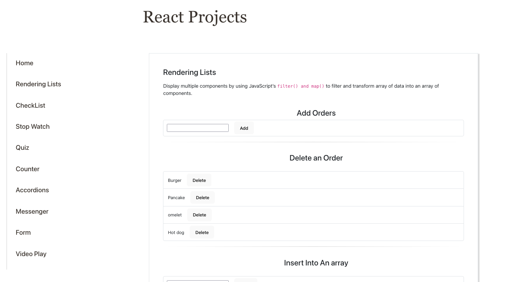

<h1 align="center" id="top">React Projects website</h1>
 
I implemented the <a href="https://juliisstudy.github.io/react-projects/">React Projects</a> website for learning and practicing React.js.
 
 

 

- **Rendering Lists**  
Display multiple components by using JavaScript’s filter() and map() to filter and transform array of data into an array of components.
- **Check List**  
- **Stop Watch**  
- **Quiz**  
- **Counter**  
- **Accordions**  
- **Messenger**  
- **Form**  
- **Video Play**  
 

## Built With

- [React.js](https://react.dev/)
- [Bootstrap](https://getbootstrap.com/)
- [React Router](https://reactrouter.com/en/main)
- [vite](https://vitejs.dev/)